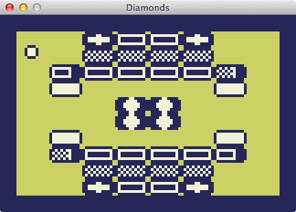

Diamonds
========



```
A loving tribute by CAP PETSCHULAT
to the HP48 game by DOUG CANNON
designed for Mac by OLIVER DREER
```

Controls
--------

```
Left: A or <Left Arrow>
Right: D or <Right Arrow>
Select, Pause: <Space> or <Return>
Kill, Quit: K or <Escape>
Change speed: 1
Change scale: 9
```


Instructions
------------

As Doug Cannon explained,

> The object of each screen is to get the diamond bricks.  Once you
have removed each diamond brick, you advance to the next level.

> Before you can erase any diamond bricks, you must erase all regular
bricks first.  A regular brick can only be erased when you are in the
correct mode.  By hitting special paintbrush bricks you can change
your brick mode.

> White bricks: You are only in the white brick mode at the start of
each level.  If you don't erase all of the white bricks before
changing modes, then you cannot solve the level.  You can never return
to the white brick mode unless you press K to kill yourself and start
over.

> Regular bricks: There are 4 different patterns of regular bricks.
You cannot clear a regular brick unless you are in the correct mode.

> Paintbrush bricks: These bricks look similar to the regular bricks,
only the right side is darkened.  Hit one of these to change your
brick mode.

> Key and lock bricks: Hit a key brick to get a key.  You cannot clear
a lock brick unless you are carrying a key.  Hitting key and lock
bricks do not modify your brick mode.  You do not need to clear all
key and lock bricks in order to solve the level.

> Arrow bricks: Hitting an arrow brick reverses the movement key
directions.  The move-left keys now move the ball right, and the
move-right keys move the ball left.  Hit a second arrow brick to
change the keys back to normal.

> Cross bricks:  Don't hit these, they kill you.

> Diamonds bricks: You can't clear these until all white and regular
bricks have been cleared.  Clear all diamonds to solve the level.


Other Versions
--------------

* [Wikipedia](http://en.wikipedia.org/wiki/Diamonds_%28video_game%29)
* [Doug Cannon's (HP48 ASM)](http://www.oocities.org/doug_cannon/)
* [Carles PV's (VB)](http://www.oocities.org/doug_cannon/vb-diamonds.zip)
* [Matthew Blaine's (C++)](https://github.com/mblaine/Diamonds)
* [Tyler Wymer's (Javascript)](https://github.com/twymer/diamonds-js)


Emulation Notes
---------------

The HP48 version runs reasonably well under emulation on Windows:

* [download Emu48vXXXSetup.zip](http://hp.giesselink.com/emu48.htm)
* select HP48GX skins when installing
* [download the HP48GX rom](http://hp.giesselink.com/emu48faq.htm#ROM)
* unzip the rom to the Emu48 directory
* from the command line in the Emu48 directory, `Convert gxrom-r ROM.48G`
* [download Diamonds](http://www.oocities.org/doug_cannon/diam20.zip)
* start Emu48
* drag the file `Diamonds` from `diam20.zip` on to the emulated screen
* press the `EVAL` button (3rd row from top, 3rd column from left)


Thanks
------

* Oliver Dreer
* Doug Cannon
* Casey Muratori for code layout inspiration in [Handmade Hero](http://handmadehero.org)
* Leonard Ritter for simple audio synthesis inspiration in [Liminal](https://bitbucket.org/duangle/liminal_lua/src)
